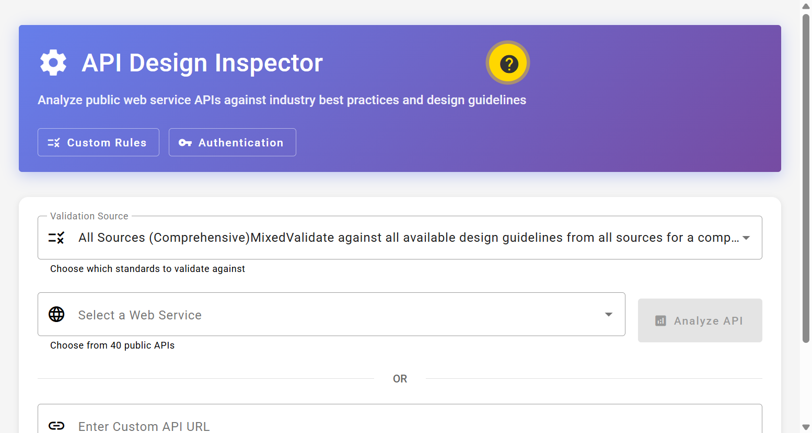
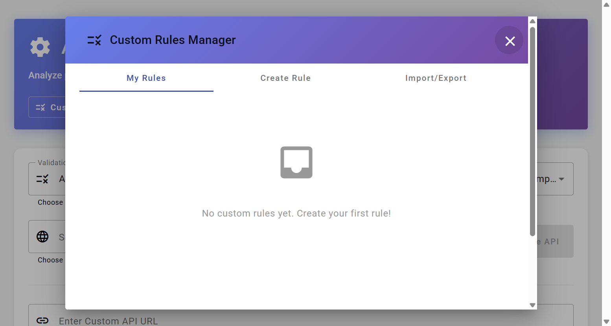
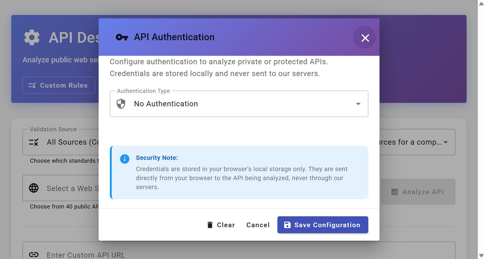

# 🔍 API Design Inspector

[](https://api-inspection.vercel.app)
[](https://github.com/mariomuja/api-inspection)
[](https://www.typescriptlang.org/)
[](https://angular.io/)
[](https://vercel.com/)

> **🎯 [Try the Live Demo →](https://api-inspection.vercel.app)**  
> Analyze any public API against industry best practices in seconds!

A comprehensive API analysis tool that evaluates RESTful web services against 40+ design rules from Google, Microsoft, OWASP, and other industry leaders. Features real-time analysis, custom rules, multiple export formats, and authentication support.

## 📸 Application Screenshots

### 🏠 Main Interface - API Analysis


*Select from 40 pre-configured public APIs or enter your own API URL for instant analysis*

---

### 📊 Analysis Results - Detailed Violations


*Comprehensive analysis with severity levels, authoritative sources, and actionable recommendations*

---

### 🔧 Custom Rules Builder


*Create, manage, and share custom API design rules tailored to your organization's standards*

---

### 🔐 Authentication Configuration


*Support for API Keys, Bearer Tokens, OAuth 2.0, and Basic Auth to analyze private APIs*

---

## 🌟 Features

### Core Functionality
- **40+ Design Rules**: Validate against Google Cloud, Microsoft, OWASP, IETF, JSON:API, OpenAPI, and more
- **Real-Time Analysis**: Instant feedback on REST API design patterns
- **Source Selection**: Choose specific authoritative sources or validate against all standards
- **40 Pre-configured APIs**: Test against popular services like JSONPlaceholder, GitHub API, REST Countries, etc.
- **Custom URL Support**: Analyze any public or authenticated API
- **Severity Filtering**: Filter violations by error, warning, or info level
- **Source Filtering**: View recommendations from specific authorities

### Advanced Features
- **Custom Rules Builder**: 
  - Create organization-specific design rules
  - Import/Export rules as JSON
  - Enable/disable individual rules
  - Pre-built templates (Company Standards, Security, Performance)
  - Local storage persistence
- **Authentication Support**:
  - API Key (custom header)
  - Bearer Token (JWT)
  - OAuth 2.0 Access Token
  - Basic Authentication
  - Secure local-only storage
- **Enhanced Detection**:
  - Tests GET, POST, PUT, PATCH, DELETE, OPTIONS methods
  - Security vulnerability scanning
  - Missing security headers detection
  - HTTP status code validation
  - CORS preflight checks
  - Idempotency verification
- **Multiple Export Formats**:
  - PDF Document with full styling
  - Markdown for documentation
  - HTML standalone report
  - CSV for spreadsheet analysis
  - JSON for programmatic use
  - GitHub Issues format
  - JIRA Issues format
  - Quality Badge generator

### Technical Analysis
- **REST Principles**: Resource naming, HTTP methods, versioning
- **HTTP Standards**: Status codes, headers, content negotiation, CORS
- **Security**: HTTPS, authentication, rate limiting, input validation
- **Data Management**: Pagination, filtering, sorting, field selection
- **Error Handling**: Consistent formats, helpful messages, status codes
- **Response Design**: Structure, metadata, HATEOAS links
- **Naming Conventions**: camelCase, snake_case, consistency
- **Performance**: Compression, caching, connection pooling, response times
- **Data Types**: ID consistency, date formats, booleans, numerics, arrays
- **Validation**: JSON Schema, input constraints, type enforcement
- **Operations**: Bulk operations, PATCH support, async operations
- **Parameters**: Query parameters, path parameters, request bodies

## 📁 Project Structure

```
api-inspection/
├── frontend/                      # Angular frontend application
│   ├── src/
│   │   ├── app/
│   │   │   ├── components/       # UI components
│   │   │   │   ├── api-inspector.component.*        # Main analysis interface
│   │   │   │   ├── custom-rules-dialog.component.ts # Custom rules builder
│   │   │   │   ├── auth-dialog.component.ts         # Authentication config
│   │   │   │   └── openapi-dialog.component.ts      # OpenAPI spec viewer
│   │   │   ├── models/           # TypeScript interfaces
│   │   │   │   ├── web-service.model.ts
│   │   │   │   ├── rule-source.model.ts
│   │   │   │   └── custom-rule.model.ts
│   │   │   ├── services/         # Business logic
│   │   │   │   ├── api-analysis.service.ts
│   │   │   │   ├── export.service.ts
│   │   │   │   ├── custom-rules.service.ts
│   │   │   │   └── pdf-export.service.ts
│   │   │   └── app.config.ts     # App configuration
│   │   └── styles.scss           # Global Material theme
│   └── package.json
├── api/                          # Vercel serverless functions
│   ├── analyze.js               # Main analysis endpoint
│   ├── openapi.js               # OpenAPI spec generator
│   ├── api-analyzer.js          # Core analysis engine
│   └── design-rules.js          # 43 design rules catalog
└── vercel.json                  # Vercel deployment config
```

## 🔍 Analysis Rules Catalog

### Supported Authoritative Sources
1. **Google Cloud API Design Guide** - Resource-oriented design, naming conventions
2. **Microsoft REST API Guidelines** - HTTP methods, pagination, consistency
3. **OWASP API Security Top 10** - Security vulnerabilities and risks
4. **IETF HTTP/1.1 Standards** - Protocol compliance, caching, idempotency
5. **JSON:API Specification** - Resource representation, relationships, metadata
6. **OpenAPI Initiative** - Documentation, schema definitions, parameters
7. **W3C CORS Specification** - Cross-origin resource sharing
8. **Stripe API Best Practices** - Versioning strategies
9. **PayPal API Guidelines** - Resource nesting, structure
10. **GitHub REST API** - Pagination metadata, discoverability
11. **AWS API Best Practices** - Response metadata, monitoring
12. **Atlassian Guidelines** - Error messages, user feedback

### Rule Categories
- REST Principles (5 rules)
- HTTP Standards (3 rules)
- Versioning (1 rule)
- Security (3 rules)
- Data Management (3 rules)
- Error Handling (2 rules)
- Response Design (4 rules)
- Naming Conventions (1 rule)
- Performance (7 rules)
- Data Types & Validation (10 rules)
- API Operations (3 rules)
- Schemas (3 rules)

## 🚀 Getting Started

### Prerequisites
- Node.js 18+ and npm
- Angular CLI 17+
- Git

### Installation

1. **Clone the repository:**
```bash
git clone https://github.com/mariomuja/api-inspection.git
cd api-inspection
```

2. **Install frontend dependencies:**
```bash
cd frontend
npm install
```

3. **Install backend dependencies:**
```bash
cd ../api
npm install
```

### Development

1. **Start the frontend development server:**
```bash
cd frontend
npm start
# Access at http://localhost:4200
```

2. **Test serverless functions locally (optional):**
```bash
cd api
npm test
```

### Building for Production

```bash
cd frontend
npm run build -- --configuration=production
```

Build artifacts will be in `frontend/dist/frontend/browser/`

## 🎨 Usage Guide

### Basic Analysis

1. **Select Validation Source**: Choose an authoritative source (Google, Microsoft, OWASP, etc.) or "All Sources"
2. **Select API**: Pick from 40 pre-configured public APIs or enter a custom URL
3. **Click "Analyze API"**: Wait for real-time analysis (typically 5-10 seconds)
4. **Review Results**: See violations grouped by category with severity indicators
5. **Filter Results**: Use severity and source filters to focus on specific issues
6. **Click Endpoints**: Open OpenAPI documentation for detailed specs
7. **Export Results**: Choose from 8 export formats

### Custom Rules

1. **Click "Custom Rules"** in the header
2. **Create Rule Tab**: Define your custom validation rule
   - Enter name, category, severity
   - Add description, rationale, and impact
   - Specify check pattern (regex or description)
3. **My Rules Tab**: View, enable/disable, edit, or delete rules
4. **Import/Export Tab**: Share rules with your team
5. **Apply Rules**: Custom rules are automatically included in analysis

### Authentication

1. **Click "Authentication"** in the header
2. **Select Auth Type**: API Key, Bearer Token, OAuth 2.0, or Basic Auth
3. **Enter Credentials**: Provide required authentication information
4. **Save Configuration**: Credentials stored locally in browser
5. **Analyze Protected APIs**: Authentication headers sent with requests

### Export Options

- **PDF**: Professional report with styling and charts
- **Markdown**: Great for GitHub/GitLab documentation
- **HTML**: Standalone webpage with full formatting
- **CSV**: Import into Excel/Google Sheets
- **JSON**: Programmatic access to results
- **GitHub Issues**: Pre-formatted issues for GitHub
- **JIRA**: Ready-to-import JIRA tickets
- **Quality Badge**: Copy badge markdown for README

## 🔒 Security & Privacy

### Data Handling
- **No Server Storage**: All analysis happens in real-time, nothing is stored
- **Client-Side Auth**: Credentials stored only in browser's localStorage
- **Direct API Calls**: Browser connects directly to analyzed APIs
- **No Tracking**: No analytics, cookies, or user tracking
- **Open Source**: Full transparency of code and data flow

### Best Practices
- Use read-only API keys when possible
- Revoke test credentials after analysis
- Don't analyze production APIs with sensitive data
- Custom rules are stored locally (use export to backup)

## 🛠️ Development

### Technology Stack
- **Frontend**: Angular 19, TypeScript, Material UI
- **Backend**: Node.js, Vercel Serverless Functions
- **Testing**: Jasmine/Karma (frontend), Jest (backend)
- **Deployment**: Vercel (frontend + serverless)
- **Dependencies**: jsPDF, html2canvas, DOMPurify

### Code Quality
```bash
# Run frontend tests
cd frontend
npm test

# Run backend tests
cd api
npm test

# Lint code
npm run lint
```

### API Endpoints

#### POST /api/analyze
Analyzes an API against design rules.

**Request:**
```json
{
  "serviceUrl": "https://api.example.com",
  "sourceFilter": "all" // or specific source: "google", "microsoft", etc.
}
```

**Response:**
```json
{
  "serviceName": "Example API",
  "serviceUrl": "https://api.example.com",
  "analyzedAt": "2025-11-08T23:00:00Z",
  "overallScore": 75,
  "violations": [...],
  "recommendations": [...],
  "summary": {
    "totalRules": 43,
    "passedRules": 32,
    "failedRules": 8,
    "warningRules": 3
  }
}
```

#### POST /api/openapi
Fetches or generates OpenAPI specification.

**Request:**
```json
{
  "serviceUrl": "https://api.example.com"
}
```

**Response:**
```json
{
  "openapi": "3.0.0",
  "info": {...},
  "servers": [...],
  "paths": {...}
}
```

## 🌐 Deployment

### Vercel (Recommended)

1. **Fork this repository** on GitHub

2. **Sign up for Vercel** (free): https://vercel.com

3. **Import Project**:
   - Click "Add New Project"
   - Import from GitHub
   - Select `api-inspection` repository

4. **Configure Build**:
   - Framework: Angular
   - Build Command: `npm run build`
   - Output Directory: `frontend/dist/frontend/browser`

5. **Deploy**: Automatic deployment on every push to main

### Custom Domain (Optional)

1. Go to Project Settings → Domains
2. Add your domain
3. Configure DNS as instructed

### Environment Variables

No environment variables required! The app works out-of-the-box.

## 📊 Performance

- **Analysis Speed**: 5-10 seconds for typical APIs
- **Bundle Size**: ~1.2 MB (gzipped: ~220 KB)
- **Serverless Cold Start**: <1 second
- **Concurrent Users**: Unlimited (serverless scaling)

## 🎯 Use Cases

### For API Developers
- Validate API design before deployment
- Ensure compliance with industry standards
- Catch common mistakes early
- Generate documentation-ready reports

### For API Consumers
- Evaluate third-party APIs before integration
- Compare API quality across vendors
- Identify potential issues and limitations
- Generate integration documentation

### For Teams
- Enforce company-specific design standards
- Share custom rules across organization
- Track API quality improvements over time
- Export to JIRA/GitHub for task management

## 🤝 Contributing

Contributions are welcome! Please:
1. Fork the repository
2. Create a feature branch
3. Make your changes
4. Add tests if applicable
5. Submit a pull request

## 📄 License

This project is provided as-is for educational and commercial use.

## 🙏 Acknowledgments

- Built with Angular 19 and Material UI
- Powered by Vercel Serverless Functions
- Design rules inspired by Google, Microsoft, OWASP, IETF, and other industry leaders
- PDF generation: jsPDF and html2canvas
- Security: DOMPurify for XSS protection

## 📞 Support

For questions or issues:
- Check the [GitHub Issues](https://github.com/mariomuja/api-inspection/issues)
- Review the source code for implementation details
- Consult the authoritative sources linked in each violation

---

**Built with ❤️ for better API design**

---

## 💼 Professional Services

Would you like to create feature-rich services & apps in short time without expensive developers working on it for weeks and months? Let me help you. I live in Hamburg.

### 📞 Contact Me

**Germany:** +49 1520 464 14 73

**Italy:** +39 345 345 0098

**Email:** mario.muja@gmail.com

I am looking forward to hearing from you!
